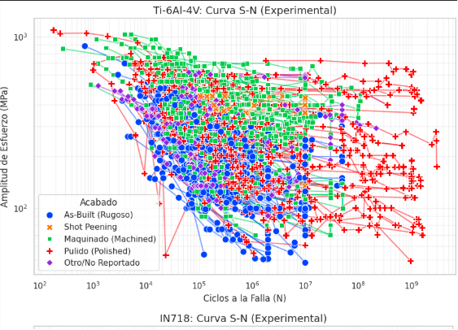

# Fatigue Analysis for Additive Manufacturing Materials

Engineering data analysis project focused on experimental fatigue behavior in metallic alloys manufactured through Additive Manufacturing (AM).
The project combines Python-based data processing, statistical analysis, and fatigue visualization techniques to study the influence of manufacturing parameters, thermal treatments, and surface finishing on fatigue life.

---

## 📌 Objective

Analyze experimental fatigue datasets from additively manufactured metallic materials in order to identify relationships between processing conditions and fatigue performance.

The study focused primarily on:
* Ti-6Al-4V
* IN718
* AlSi10Mg

These materials were selected due to their high amount of available experimental data.

---

## 🛠️ Tools and Libraries

* Python
* Pandas
* NumPy
* Matplotlib
* Seaborn
* Statsmodels
* Scipy Stats
* Google Colab

---

## 🚀 Project Workflow

### 1. Dataset Preparation

* Cleaning and standardization of Excel datasets
* Removal of inconsistent characters and formatting
* Column normalization for automated processing

### 2. Exploratory Data Analysis

* Material and process classification
* Experimental data organization
* Identification of dominant manufacturing parameters

### 3. Fatigue Analysis

* Generation of S-N curves
* Basquin trend analysis
* Comparative visualization between:

  * Surface finishes
  * Thermal treatments
  * Manufacturing processes

### 4. Statistical Evaluation

* P-value based correlation analysis
* Evaluation of parameter significance on fatigue behavior

---

## 🧠 Key Findings

* Surface finishing showed a strong influence on fatigue life across all analyzed materials.
* Machined and polished samples generally exhibited improved fatigue performance compared to as-built conditions.
* Ti-6Al-4V showed significant sensitivity to thermal treatment temperature.
* IN718 and AlSi10Mg presented more stable behavior under thermal treatment variations.

---

## Example Visualizations

### Ti-6Al-4V Experimental S-N Curves

### IN718 Experimental S-N Curves

### AlSi10Mg Experimental S-N Curves

---

## Engineering Context

This repository is part of my mechanical engineering technical portfolio and reflects the application of programming and data analysis tools to materials engineering and fatigue analysis problems.
